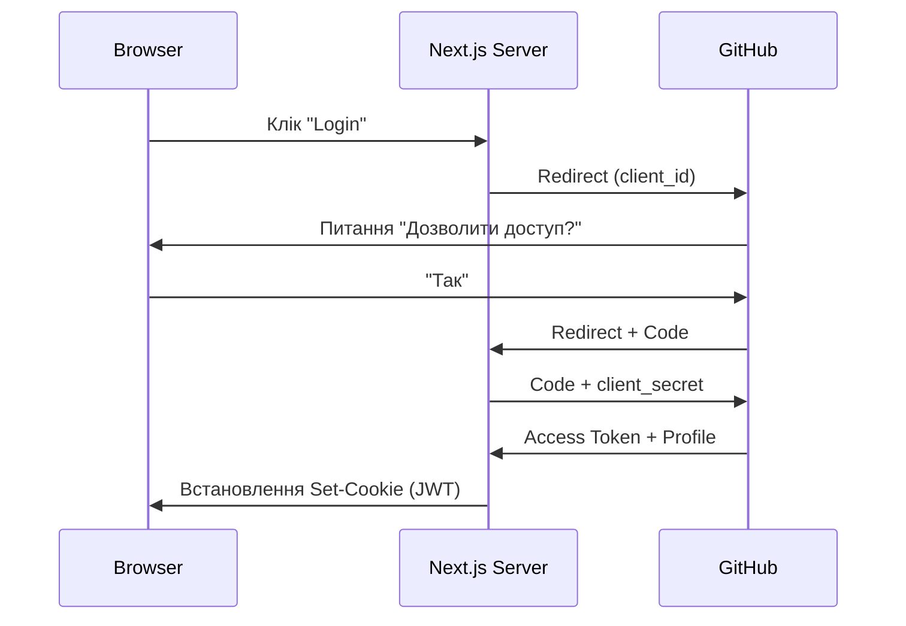

# Lesson 19: Глибоке занурення в Auth.js v5

## 🎯 Мета уроку
Зрозуміти архітектуру сучасної аутентифікації в Next.js 16. Ми не просто "підключимо логін", а розберемося, як працюють токени, сесії та захист маршрутів на рівні сервера.

---

## 📖 Глибока Теорія

### 1. Еволюція: Від NextAuth v4 до Auth.js v5
Раніше аутентифікація в Next.js була прив'язана до системних API (Pages Router). Версія v5 — це "NextAuth, переосмислений для App Router".
- **Відсутність дублювання**: Тепер у нас є єдиний файл `auth.ts`, який є джерелом правди.
- **Edge Middleware**: Бібліотека працює в Edge Runtime, що дозволяє перевіряти сесію за мілісекунди до того, як запит взагалі дійде до твоїх сторінок.

### 2. Як працює OAuth 2.0 (на прикладі GitHub)
Коли ти натискаєш "Login with GitHub", відбувається танець (Handshake):
1. **Redirect**: Твій додаток відправляє користувача на GitHub з твоїм `CLIENT_ID`.
2. **Consent**: Користувач каже GitHub: "Так, я дозволяю цьому додатку бачити мою пошту".
3. **Code**: GitHub повертає користувача назад на твій `callback URL` зі спеціальним тимчасовим кодом у URL.
4. **Exchange**: Твій сервер (Auth.js) бере цей код + твій `CLIENT_SECRET` і потайки відправляє їх назад GitHub.
5. **Token**: GitHub бачить, що секрет правильний, і дає `Access Token`.
6. **Profile**: Auth.js використовує токен, щоб забрати ім'я та аватар користувача, і створює сесію.

### 3. JWT vs Database Sessions
За замовчуванням Auth.js використовує **JWT (JSON Web Tokens)**:
- **JWT (Stateless)**: Вся інформація про користувача шифрується і записується прямо в куку браузера. Серверу не потрібна база даних, щоб "впізнати" користувача — він просто розшифровує куку своїм `AUTH_SECRET`.
- **Database (Stateful)**: В куці зберігається лише випадковий ID сесії, а всі дані лежать у базі (Postgres/MongoDB). Це надійніше, але потребує запиту до бази при кожному кліку.

### 4. Функція `auth()` — серце системи
В Next.js 16 ми використовуємо `auth()` скрізь:
- **У Server Components**: `const session = await auth()`. Це працює миттєво, бо немає HTTP-запитів, просто читання куки на сервері.
- **У Middleware**: Для захисту цілих розділів сайту (наприклад, `/admin/*`).

---

## 🏗️ Архітектурна схема (Mermaid)

---

## ⚠️ Важливі нюанси Next.js 16
1. **Caching**: Функція `auth()` автоматично робить сторінку динамічною (як і `headers()` чи `cookies()`). Якщо ти викликаєш її, Next.js не зможе закешувати цю сторінку як статичний HTML.
2. **Security**: Ніколи не виводь `session` в консоль на стороні Клієнта (браузера), якщо там є чутливі дані (наприклад, токен доступу).

## 🍪 Cookie vs 🔑 JWT: Велике роз'яснення

Це найважливіша частина для розуміння того, як працює безпека. 

### 1. Фундаментальна різниця
Уяви, що ти відправляєш цінні документи поштою.
- **Cookie (Кука)** — це **Конверт**. Його властивість у тому, що пошта (браузер) автоматично доставляє його за адресою отримувача щоразу, коли ти пишеш листа.
- **JWT (Token)** — це **Документи всередині**. Це текст, написаний за певними правилами, який підтверджує твої права.

> **У Auth.js ми використовуємо обидва**: Ми беремо JWT (документ) і ховаємо його в Cookie (конверт).

| Особливість | Cookie (Транспорт) | JWT (Формат даних) |
|-------------|--------------------|-------------------|
| **Що це?** | Механізм зберігання в браузері | Підписаний рядок тексту (JSON) |
| **Хто надсилає?** | Браузер автоматично | Потрібно прикріплювати вручну (якщо не в куці) |
| **Де лежить?** | Вкладка "Application" -> Cookies | Може лежати в LocalStorage, Headers або Cookies |
| **Безпека** | Захищається прапором `HttpOnly` (JS не може вкрасти) | Захищається підписом (не можна підробити) |

---

### 2. Які бувають токени (Vocabulary)

У світі розробки ти почуєш ці назви постійно:

1. **Session Token / Session ID**: 
   - Якщо це **ID**, то на сервері є база даних, де лежить інфо.
   - Якщо це **JWT**, то вся інфо зашифрована прямо в імені токена. (Auth.js v5 робить саме так).
   
2. **Access Token (Токен доступу)**: 
   - Дуже короткочасний (наприклад, 15 хв). 
   - Дає право "відчиняти двері". Саме його ми відправляємо в GitHub API.

3. **Refresh Token (Токен оновлення)**: н
   - Довготривалий (тиждень/місяць). 
   - Його єдина мета — отримати новий Access Token, коли старий "протухне".

---

### 3. Повний життєвий шлях куки з JWT (Auth.js)

1. **Запит (Request)**: Користувач вводить логін або тисне "GitHub Login".
2. **Перевірка (Verify)**: GitHub каже серверу "Він — ок".
3. **Генерація (Issue)**: 
   - Auth.js створює **JWT**. 
   - У JWT записує: `{ user: "Ivan", expires: "завтра" }`. 
   - Сервер підписує цей текст секретним ключем `AUTH_SECRET`.
4. **Транспортування (Set-Cookie)**: Сервер відповідає браузеру: `Set-Cookie: session-token=<зашифрований_JWT>; HttpOnly; Secure;`.
5. **Зберігання**: Браузер зберігає цей конверт.
6. **Автоматична перевірка**: Наступного разу, коли ти клікаєш "Мій профіль", браузер **автоматично** дістає цей конверт і віддає серверу.
7. **Розкодування (auth())**: Функція `auth()` на сервері бере цей конверт, дістає JWT, розшифровує його і повертає тобі об'єкт `session`.

---

## ✍️ Практика

Нині ми інтегруємо ці знання в наш `practice-project`.

### Задача 1: Розминка (5-10 хвилин) — "Двері для GitHub"
1. Створи Route Handler за шляхом: `app/api/auth/[...nextauth]/route.ts`.
2. Експортуй туди `handlers` з твого файлу `auth.ts`.
3. Перевір, чи працює системна сторінка за адресою `http://localhost:3000/api/auth/signin`.

### Задача 2: Основна (15-20 хвилин) — "Своя кнопка"
1. В папці `app/components` створи компонент `LoginButton.tsx`.
2. Це має бути клієнтський компонент з кнопкою "Login via GitHub".
3. При натисканні на кнопку має викликатися функція `signIn("github")` (імпортуй її з `next-auth/react`).

### Задача 3: Челлендж (20-30 хвилин) — "Серверна сесія"
1. У головному хедері сайту (або на домашній сторінці) використай асинхронну функцію `auth()`.
2. Якщо сесія є (`session !== null`), покажи аватарку та ім'я користувача.
3. Якщо сесії немає — покажи кнопку з Задачі 2.

---

## ✅ Перевірка розуміння (відповідай у notes.md):

1. Чому ми кажемо, що JWT — це **"Self-contained"** (самодостатній)? (Подумай, чи потрібно нам йти в базу даних, щоб дізнатися ім'я користувача, якщо у нас є валідний JWT).
2. Якщо ми використовуємо `HttpOnly` куки, чи зможе хакер через `console.log(document.cookie)` вкрасти твій JWT?
3. Чим Auth.js сесія відрізняється від звичайної PHP сесії (якщо ти чув про такі)?
