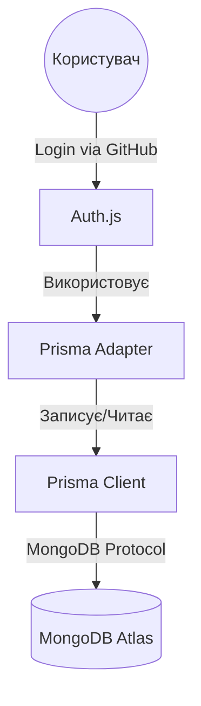

# Lesson 20: Інтеграція Auth.js з Базою Даних (Prisma + MongoDB)

## 🎯 Мета уроку
Навчити наш додаток "запам'ятовувати" користувачів назавжди. Ми підключимо базу даних, щоб Auth.js автоматично створював запис про нового користувача при першому вході.

---

## 📖 Глибока Теорія

### 1. Проблема JWT-only підходу
До цього моменту ми використовували лише JWT. Кожен раз, коли користувач заходить через GitHub, Auth.js створює токен "на льоту".
- **Мінус**: Ми не можемо зберегти додаткову інформацію про користувача (наприклад, його номер телефону, роль чи список куплених товарів) у надійному місці.
- **Мінус**: Ми не бачимо списку всіх наших користувачів.

### 2. Що таке Auth.js Adapter?
**Adapter** — це "перекладач" між бібліотекою Auth.js та твоєю базою даних. 
Коли відбувається логін, Adapter каже базі:
1. "Глянь, чи є в тебе юзер з таким email?"
2. "Якщо немає — створи нового."
3. "Якщо є — онови його аватарку/ім'я."

### 3. Чому Prisma?
Ми будемо використовувати **Prisma** як ORM (Object-Relational Mapping).
- **Prisma** дозволяє нам описувати структуру бази (Schema) у зручному форматі.
- Вона автоматично генерує типи для TypeScript.
- Вона ідеально працює з MongoDB.

### 4. Схема даних для Auth.js
Щоб Auth.js міг працювати з базою, йому потрібні 4 конкретні таблиці (колекції в MongoDB):
1. **User**: Самі дані користувача (email, name, image).
2. **Account**: Дані про метод входу (наприклад, кожна людина може зайти і через GitHub, і через Google — це два акаунти одного юзера).
3. **Session**: Дані про активні сесії (якщо ми не використовуємо JWT).
4. **VerificationToken**: Для входу через email (магічні посилання).

---

## 🏗️ Архітектура (Mermaid)

---

## 🛠️ Нові інструменти

1. **MongoDB Atlas**: Хмарний сервіс для бази даних. Не треба нічого ставити на комп'ютер.
2. **Prisma Client**: Бібліотека, яку ми будемо викликати в коді: `prisma.user.findMany()`.

---

## ✅ Перевірка розуміння (відповідай у notes.md):

1. Чим відрізняється таблиця `User` від таблиці `Account` в контексті Auth.js?
2. Навіщо нам взагалі потрібна Prisma, якщо можна писати запити до MongoDB напряму через офіційний драйвер?
3. Що станеться, якщо ми видалимо запис з таблиці `Account`, але залишимо запис у `User`?
